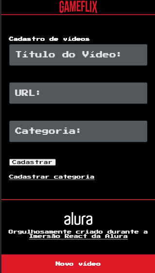
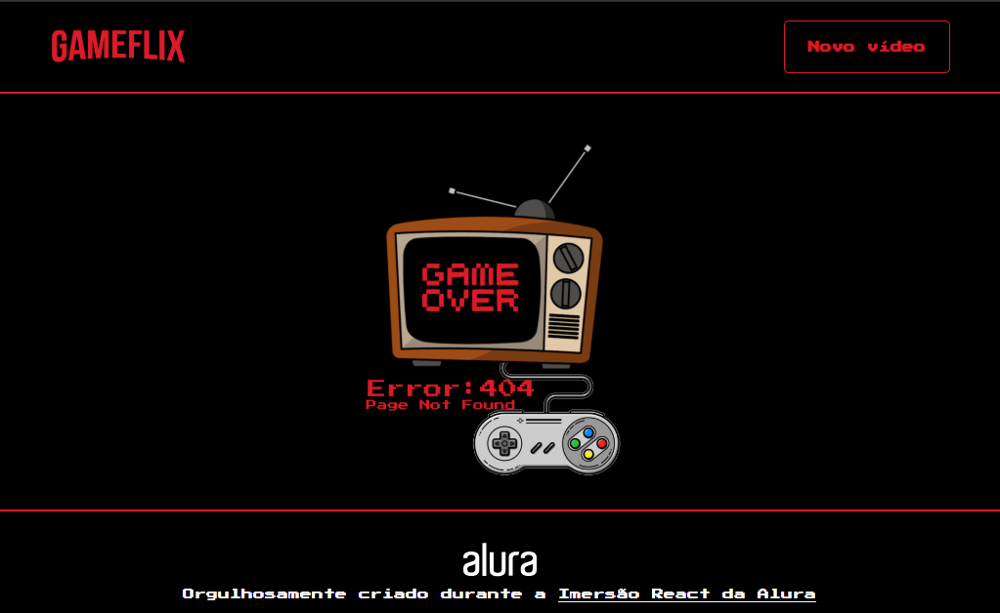

  

<h3 align="center">
  <a href="#objetivo">Objetivo</a>&nbsp;|&nbsp;
  <a href="#tecnologias">Tecnologias</a>&nbsp;|&nbsp;
  <a href="#funções">Funções</a>&nbsp;|&nbsp;
  <a href="#prints-do-sistema">Prints do sistema</a>&nbsp;|&nbsp;
  <a href="#como-usar">Como usar</a>&nbsp;|&nbsp;
</h3>

  

  Gameflix é um projeto inspirado na netflix, porém voltado somente para games.

[Teste o projeto aqui](https://gameflix-gules.vercel.app/)

## **Objetivo**
Hoje o mundo gamer é bem grande, repleto de conteúdos diversos, e cada vez mais tem novidades para esse público, pensando nisso o gameflix é uma plataforma que concentra todo conteúdo gamer em um lugar, para facilitar a navegação de usuários.

## **Tecnologias**
O projeto foi desenvolvido utilizando as seguintes tecnologias

  * **React Router Dom**
  * **React-App**
  * **JavaScript**
  * **React**
  * **IDE: VSCode**
  
## **Funções**
  * **Listar vídeos:** Lista os vídeos conforme sua categoria;
  * **Adicionar vídeos:** Adiciona vídeo através de um formulário;
  * **Adicionar categoria:** Adiciona categoria através de um formulário.
  
## **Prints do sistema**

<b>Mobile</b>

  
    

**Página de erro**

  
## Como usar
  * Pré-requisitos
    * É preciso ter um gerenciador de pacotes seja o NPM ou Yarn.
    * Uma IDE como vsCode

<ol>
  <li>Faça um clone :</li>
</ol>

<pre>  $ git clone https://github.com/JonathanKBP/Gameflix.git</pre>

<ol start="2">
  <li>Executando a Aplicação:</li>
</ol>

<pre>  # Instale as dependências
  $ npm install
  
  ou
  
   $ yarn install

  # Inicie a aplicação web
  $ npm run server

</pre>
  
